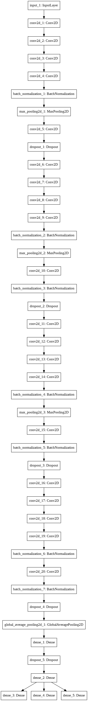

## About Us

The Powerpuff Girls are a team of students from Brown University's DATA 2040 Class: Amanda Khoo, Laura McCallion, and Marie Schenk. Follow our progress through our midterm project assignment here!

IMPORTANT NOTE:
Please be sure to download bengali_cv19.zip if you plan to run our notebook locally. You can find it in our [google drive](https://drive.google.com/open?id=1iiedL5RsjsnZKaw8gY4yZAZPbGdP9ce1). Alternatively, you can open our notebook in colab in the google drive and the associated files are already in the specified folders. 

[Bengali language background and model selection: February 18th, 2020](https://github.com/mhschenk/powerpuff/blob/master/README.md#first-entry---february-18-2020)
(\)
[Data Augmentation: March 3, 2020](https://github.com/mhschenk/powerpuff/blob/master/README.md#second-entry---march-3-2020)
(\)
[A Summary of Our Work: March 11, 2020](https://github.com/mhschenk/powerpuff/blob/master/README.md#third-entry---march-11-2020)

## First Entry - February 18, 2020

Hello! Welcome to our blog, which will detail our progress through our midterm project for the class DATA 2040 at Brown University. The project is the [Kaggle competition](https://www.kaggle.com/c/bengaliai-cv19) to classify handwritten graphemes of the Bengali language. As explained on the competition homepage, a grapheme is the smallest unit of a written language. Graphemes represent individual sounds in the words of a language Bengali has 18 accents (or diacritics)  that can be added to its 49 letters. The combination of diacritic and letter makes up a grapheme. Therefore, Bengali has many more graphemes than English does, and the task of identifying and classifying handwritten Bengali graphemes is more complicated than in English. If you're interested in understanding more about the Bengali alphabet, we recommend [these slides](https://bengali.ai/wp-content/uploads/CV19-COCO-Grapheme.pdf) and [this website](http://www.lingvozone.com/Bengali). 

Like many in the class, we have started with [this notebook,](https://www.kaggle.com/kaushal2896/bengali-graphemes-starter-eda-multi-output-cnn) which was suggested to us by our TA. Today, we will give you a look at the data we are working with and our early thoughts for the construction of our classification model.

Because there are so many graphemes in Bengali, it's infeasible to look at all possible graphemes that might ultimately come through our model. Here are some statistics on the most common graphemes in our dataset. 

The top ten roots in the training set are:

|index      | component | count |
|-----------|-----------|-------|
|   72      |    দ      |   5736|
|64 |       ত |  5596 |
|13 |         ক |   5420 |
|107 |         ব |   5321 |
|23 |         গ |   5149 |
|96 |         প |   4926 |
|113 |         ভ |   4395 |
|147 |         স |   4392 |
|133 |         শ |   4374 |
|115 |         ম |   4015 |

The bottom ten roots in the training set are:

|index | component |  count |
|----|----|----|
|73  |  দ্ঘ |    130 |
|33  |  ঙ্ক্ত |    136 |
|102 |  প্স |   141 |
|158 |  স্স |    143 |
|45  |  জ্জ্ব |    144 |
|130 |  ল্ব |   144 |
|1   | ঃ |    145 |
|12  |  ঔ |    146 |
|0   |   ং |    147 |
|63  |  ণ্ণ |    149 |

As you can see, there are many fewer examples of these bottom ten roots than the top ten. We expect that our model will do better on the components with more examples. This is something for us to consider as we start getting results. 

The top five vowels in the training dataset (not including the diacritics that could be added) are:

|index | component|  count|
|---|---|---|
|168 |         0 |  41508 |
|169 |         া |  36886 |
|175 |         ে |  28723 |
|170 |         ি |  25967 |
|172 |         ু |  18848 |

The top five consonents present in the training dataset are:

|index | component |   count|
|---|---|---|
|179 |         0 |  125278 |
|181 |        র্ |   23465 |
|184 |        ্র |   21397 |
|183 |        ্য |   21270 |
|180 |         ঁ |    7424 |

### Early Results

Thus far, we have run the model on four different subsets of training data. These graphs indicate that we should focus especially on increasing the accuracy of the model's classification of roots, as those consistently score the lowest across the different datasets. 

### Next Steps
For the subsequent steps of our project, we will focus on improving the performance of this notebook. We can adjust training time (number of iterations), examine for over- or under-fitting, and adjust various aspects of the model architecture in order to find potential improvements. We also plan on examining the techniques used in the most effective models based on the best scoring kaggle notebooks, and potentially adapt them for use in our base model. 

Stay tuned for further updates as we continue working on this project!

## Second Entry - March 3, 2020

Welcome back! In addition to working on the model itself, we've worked on the training data we're feeding into the model. This entry explains that process in greater detail.

### Augmenting Data

One of the most fundamental ways to improve the performance of a neural net model is to train it on more data. The more data a model has seen, the more precisely it can estimate parameters and the better it can handle new, unseen data. We've taken a similar approach to other teams who have publicly posted their notebooks on Kaggle, which is to augment our data with altered versions of the existing images. We've added Gaussian noise, rotated the images left and right, and heightened the clarity. Examples of these modifications are shown below. The original source for these modifications is [this notebook on Kaggle]("https://www.kaggle.com/chekoduadarsh/bengali-ai-understand-and-augment-eda"). We wrote a series of functions to apply the modifications to a subset of the training data and create new dataframes. We created four, one with each of the modifications below applied. 

Here is an image with Gaussian noise added. The background and character are no longer just two separate colors.

Here is an image rotated to the right...

...and one rotated to the left.

An image with the intensity changed to make the character more clear:

We then converted the dataframe into a parquet file that matches the format of the original files, keeping the original image ID number attached to each altered image. This will allow us to feed the new data through our existing pipeline. The augmentation code worked on a single image at a time and output a two dimensional array that lent itself to plotting. In order to retain the original image id (needed for our training loop later), we wrote a for-loop and saved each output in a dictionary, with the image id as a key. The entries, then, were two dimensional. So although that could be converted into a dataframe, it could not then be converted to a parquet file. We solved this problem by flattening the image before adding it to the dictionary. We then had to make some additional adjustments to the indexing in order to make a parquet file that looked like an exact match to the original training files, as well as converting the numbers from floats to the CV-8UC1 format. In the end, we have four additional training files for our model.

## Third Entry - March 11, 2020

We’ve completed our changes to the model! We’ve approached improving the model from three major approaches:
Data Augmentation
Model architecture
Automated model hyperparameter

For our third blog post, we’re going into depth about what changes we made to the base model and why. But first, let’s go through the original model in more detail.

## Original model

We started by understanding Kaushal Shah’s model. This user made his notebook digestable and public, which we really appreciated. Below, you can see the architecture of Kaushal Shah's convolutional neural network. You can find his full notebook [here] <https://www.kaggle.com/kaushal2896/bengali-graphemes-starter-eda-multi-output-cnn> 

This network consists of multiple convolutional layers with an increasing number of filters. Every four layers is followed by a batch normalization to protect against exploding/ diminishing gradient issues, as well as a max pooling layer. Here, pooling is done spatially (2D), meaning only the most informative pixels in a certain pool size is taken to the next layer. This decreases the overall size of the image, decreasing computation time. Dropout is added after pooling to reduce overfitting and spread learning across many neurons and many layers. Finally, the outputs are flattened into a 1D array and run through 3 dense layers with “softmax” activation corresponding to the three predictions we are making (list the types of diacritics here).

Kaushal's model performance is really good -- 95.6% accuracy. Improving this score is difficult. We approached gaining improvements by focusing on 1) data augmentation, 2) Changing model architecture, and 3) Automated hyperparameter tuning with KerasTuner. 

## Data Augmentation

Data augmentation means artificially increasing the size of your training set by distorting the existing images and then feeding them through the model as new images. So in addition to altering the architecture of the model, we've created four new datasets of altered images to allow the model more training opportunities. We discussed the four modifications we made in our second blog post. We chose those because they seemed to most closely resemble the sorts of things the model will encounter in the real world. Adding gaussian noise mimics an unclear photocopy the model might encounter. Similarly, altering the intensity reflects the fact that handwritten documents are not uniform in their color contrast. Rotating left and right mimics the fact that handwriting is rarely perfectly straight. Flipping an image is another common way to alter image data, but we did not use this because it is highly unlikely that a model meant to parse handwriting would encounter mirror-image letters.

## Model Architecture

The original architecture proved to be extremely well scoring, so we didn’t want to change too much about the setup. Here are some graphs of the original model performace across epochs across four training sets:

It should be noted that it is common for the validation sets to score much higher than training. This is due to the implementation of dropout that is active during training. This means that only some of the neural network is being used during training (some neurons are dropped out), while during validation the full learned network is used. 

We attempted to add three changes to this architecture:
1. Removing and changing dropout layers
2. Adding GlobalAveragePooling2D
3. Adding DepthwiseMaxPooling

### Removing and changing dropout layers

Rationale: Dropout helps prevent overfitting. Our hunch was that, potentially, we were underfitting and decreasing the number of dropout layers could help with this. 

Implementation: We played around with various droupout momentum and by removing the dropout layers closest to the output. 

Results: Somewhat unsurprisingly, changing the dropout layer architecture in the above two ways was not successful. We did not bother reporting the scores here since accuracy decreased. This is clearly observed in the following training-validation accuracy plots. Shown here is a representative training-validation plot from varying the dropout architecture. You can see that the vowel accuracy has gone down to about 0.92, while before it was slightly higher (see original accuracy plots).

### Adding Global AveragePooling2D

Rationale: Global average pooling averages every feature map at the end of a neural net and can be used in place of the flatten() function. This is of course, extremely destructive, since feature maps are compressed into the average of their pixels. However, this can be useful in making the model invariant to characterisitcs we would rather a handwriting model not pick up, such as line thickness and hand slant. Additionally, global average pooling is used in some famous architectures, such as GoogLeNet and Xception.

Implementation: 

Our new architecture is the same as the original, but replaces the final flatten() layer with a GlobalAveragePooling2D layer.

Results: We improved the score by 0.01. One major drawback, however: this model takes much longer to run from this addition. For comparison, the original model runs 15 epochs with a batch size of 256 in ~5 minutes. With global average pooling, the model runs the same number of epochs in ~ 30 minutes. Running these models multiple times to get an average score, we’re looking at a difference (2 hours - 20 minutes) of about 1 hour and 40 minutes. Our accuracy plots can be found below for 4 training-validation sets.

### Adding DepthwiseMaxPooling

Rationale: Another uncommonly implemented method, depthwise max pooling pools across different feature maps (the batch dimension!) in a convolutional layer. Generally, pooling is applied in the XY of the image alone. This type of pooling is mainly useful for handwriitng recogition classification problems. This is because pooling over the depth of the filter can help make the model invariant to the spatial differences in the image-- basically, you want a model that’s going to recognize the character no matter where it is in the image, and regardless of orientation or slant. This is also used in a number of famous architectures (list).

Implementation: 

Depthwise pooling should be placed after the convolutional layers and batch normalization. Here, implementation is attempted using a lower level tensorflow api wrapped in a Keras lambda function (a custom layer). 

Results:
Unfortunately, we weren’t able to successfully train with this change. We ran into a number of different errors including:

 

and if we tried to run on CPU alone, 

We tried other functions that looked similar to depthpooling such as MaxPooling3D keras function.

Our hunch, however, is that this was created for 3D data, not 2D data with batching across multiple feature maps, because the input for maxpooling3D expects a 4 dimension input (number of images in the stack, imagesizex, imagesizey, channels). We tried training with the following 3D model, but the rest of the model is written for 2D data-- this contributes to our hunch that MaxPooling3D does not have the same functionality as Depthwise Pooling.

## Automated hyperparameter tuning with KerasTuner

Rationale: To supplement our work with the model architecture, we tried to implement automated hyperparameter tuning with KerasTuner. KerasTuner is a package designed to implement a model multiple times with different hyperparameters in order to find the best outcome based on a predetermined objective. Hyperparameter tuning would allow for an improved version of the model to then be trained, which could result in increased performance.

Implementation: While we were able to make a version of the model with KerasTuner, several issues ultimately prevented it from being effective.

First, KerasTuner requires a significantly newer version of Tensorflow than was previously used by our model. Currently, even the working notebook requires a mid-session restart of runtime in order to function properly. In addition, KerasTuner is unintuitive to work with within the training loop as it exists in the basic model.

Second, KerasTuner is a slow process. Considering the complexity of the model architecture, an exhaustive search would be extremely time-intensive. Even with the limited set of parameters tested, running the training loop often took an order of magnitude longer than the training loop with the basic model. It may be possible to implement a new objective that uses the combined accuracy of all three outputs, but this type of modification would require more research into the design of kerastuner, which was not possible for this project.

Last, KerasTuner is designed with a single objective. For this particular model, accuracy would be the most intuitive choice for that objective. However, the model we were using had three outputs. This means that the tuner, as it stands, can only optimize for the accuracy of one part of the output. This can result in a model with extremely variable accuracies, such as a root accuracy of 14%, and a vowel accuracy of 80%. 

Results: Due to these reasons, while we were able to implement a version of the model that ran with automated hyperparameter tuning, it severely underperformed when compared to the basic model.

In the future, KerasTuner may have the potential to be a promising addition to this project, if given more time -- both to run tests and, most importantly, to implement a new objective for the tuner.

